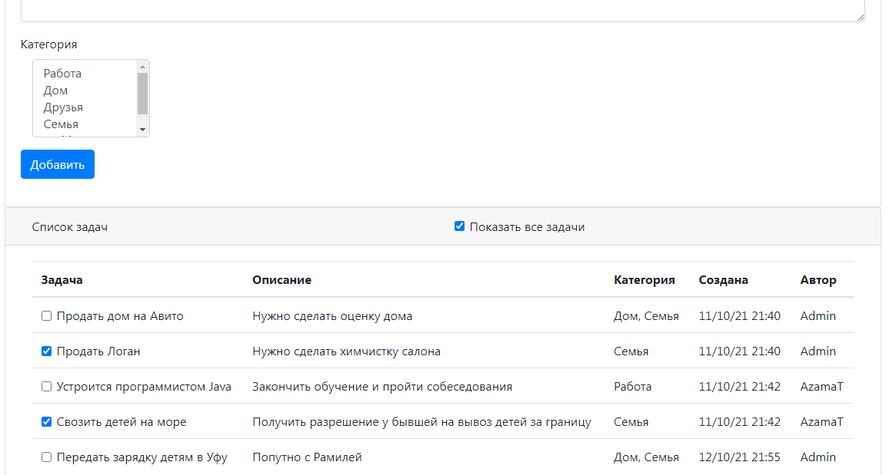

# job4j_todo

В данном проекте реализован планировщик задач TODO:
Можно добавлять новые задачи с описанием в список.
Добавлять и просматривать задачи имеет право только авторизованный
пользователь.
По мере выполнения задач, можно их помечать как выполненые,
после чего задачи пропадают из списка.
Реализован фильтр отображающий только активные задачи или все задачи,
как активные, так и завершенные.

В данном проекте применены технологии: Hibernate, Bootstrap, Servlet,
шаблон MVC, PostgreSQL, H2, JavaScript, AJAX, JSON

Проект разворачивается на сервере Apache Tomcat.
Все данные сохраняются в PostgreSQL или H2 через Hibernate

Скриншоты:
1. Форма добавления новой задачи в список. Список задач не показан, 
т.к. нет авторизации. Добавить задачу тоже не получится без авторизации
   
2. Форма авторизации с валидацией
   
3. Форма регистрации с валидацией
   
4. Авторизованному пользователю показаны активные задачи,
выполненные задачи не отображаются
   
5. Но их можно увидеть, поставив галочку "Показать все задачи"
   
